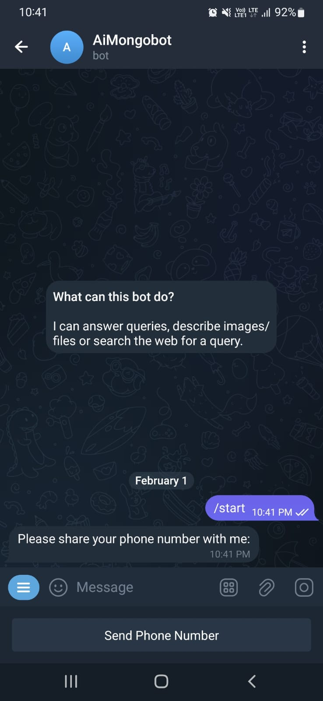
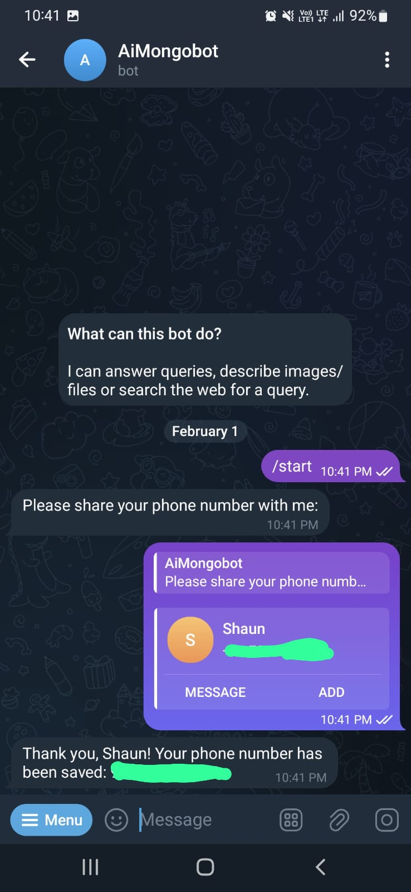
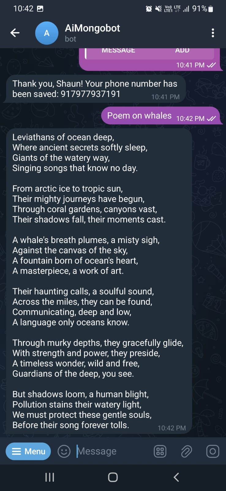
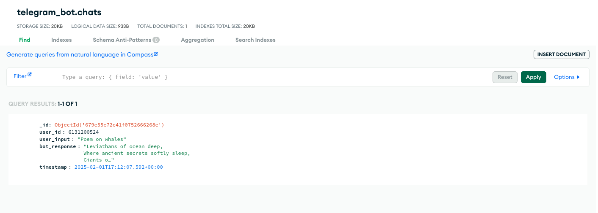

# **🤖 AI-Powered Telegram Bot (Text & Image Processing)**  

A Telegram bot that integrates **Gemini AI** for text and image analysis, with **MongoDB** for chat history storage. 🚀  

## **🔹 Features**  
✅ **Chat with Gemini AI** – Send text, and the bot responds with intelligent answers.  
✅ **Image & File Processing** – Upload images or PDFs, and Gemini AI will analyze them.  
✅ **MongoDB Integration** – Stores user chats, images, and metadata.  
✅ **User Registration** – Saves user details for tracking and improvements.  

---

## **📌 Commands & Usage**  

| Command   | Description  |
|-----------|-------------|
| `/start`  | Register user and start the bot. |
| **Text Message**  | AI replies with intelligent responses. |
| **Image Upload**  | Gemini AI analyzes the image and responds. |
| **PDF Upload**  | AI extracts and processes the content. |

---

## **🛠️ Tech Stack**  
- **Python** (telegram.ext, pymongo)  
- **Google Gemini AI** (text & image processing)  
- **MongoDB Atlas** (database for chats & files)  

---
## **📸 Screenshots**  

### **1️⃣ Register**  
 
 

### **2️⃣ Chat With AI**
 

### **3️⃣ Mongo Atlas**
 

💡 **Contributions & Issues**  
Feel free to submit PRs or report issues!  

---
